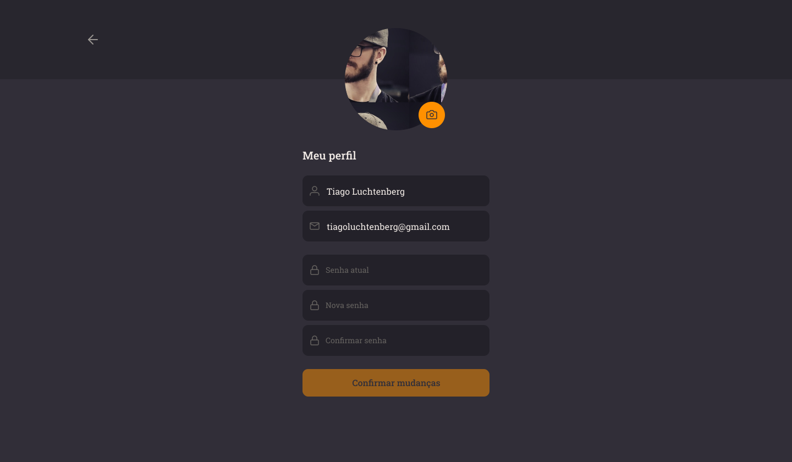

<h1 align="center">
     💈 <a href="#" alt=""> GoBarber </a>
</h1>

<h3 align="center">
    💈 App web/mobile para barbearia que permite agendamento de horário 💇🏽
</h3>

<p align="center">
  

  
  
  <a href="https://github.com/lucasbarzan/gofinances/commits/master">
    
  </a>
    
   
   <a href="https://github.com/lucasbarzan/gofinances/stargazers">
    
  </a>
</p>

<h4 align="center">
	Concluído 🚀
</h4>

Tabela de conteúdos
=================

   * [Sobre o projeto](#sobre-o-projeto)
   * [Funcionalidades](#funcionalidades)
   * [Layout](#layout)
     * [Web](#layout-web)
     * [Mobile](#layout-mobile)
   * [Como executar o projeto](#como-executar-o-projeto)
     * [Pré-requisitos](#pre-requisitos)
     * [Rodando o servidor](#rodando-o-backend)
     * [Rodando a aplicação web (Frontend)](#rodando-a-aplicacao-web-frontend)
     * [Rodando a aplicação mobile (Frontend)](#rodando-a-aplicacao-mobile)
   * [Tecnologias](#tecnologias)
     * [Server](#tecnologias-server)
     * [Website](#tecnologias-website)
     * [Mobile](#tecnologias-mobile)
     * [Utilitários](#utilitarios)
   * [Como contribuir no projeto](#como-contribuir)
   * [Autor](#autor)
   * [Licença](#licenca)


## 💻 Sobre o projeto <a name="sobre-o-projeto"></a>

💈 O GoBarber é um app para barbearia com interface web para os barbeiros e interface mobile para os clientes, que permite agendamento de horário

Projeto desenvolvido durante o bootcamp **GoStack** oferecido pela [Rocketseat](https://rocketseat.com.br/).

---

## ⚙️ Funcionalidades <a name="funcionalidades"></a>

- [x] Barbeiros podem utilizar a plataforma web para:
  - [x] Cadastrar-se, fazer login e recuperar a senha
  - [x] Atualizar seu perfil
  - [x] Listar seus agendamentos por data
- [x] Os usuários tem acesso ao app mobile, onde podem:
  - [x] Cadastrar-se, fazer login e recuperar a senha
  - [x] Atualizar seu perfil
  - [x] Listar os prestadores de serviço (barbeiros)
  - [x] Listar os horários disponíveis por data para cada barbeiro
  - [x] Fazer um agendamento

---

## 🎨 Layout <a name="layout"></a>

O layout da aplicação está disponível no Figma:

<a href="https://www.figma.com/file/8szO6rJwdHlSaF95n2vKgW/GoBarber">
  
</a>

### Web <a name="layout-web"></a>

<p align="center" style="display: flex; align-items: flex-start; justify-content: center;">
  

  
</p>

<p align="center" style="display: flex; align-items: flex-start; justify-content: center;">
  
  
  
</p>

### Mobile <a name="layout-mobile"></a>

<p align="center" style="display: flex; align-items: flex-start; justify-content: center;">
  

  
  
  
  
  
</p>

---

## 🚀 Como executar o projeto <a name="como-executar-o-projeto"></a>

Este projeto é divido em duas partes:
1. Frontend Web (pasta web) 
2. Frontend Mobile (pasta mobile)
3. Backend (pasta server)

💡 Tanto o Frontend Web quanto o Mobile precisam que o Backend esteja sendo executado para funcionar

### Pré-requisitos <a name="pre-requisitos"></a>

Antes de começar, você vai precisar ter instalado em sua máquina as seguintes ferramentas:
[Git](https://git-scm.com), [Node.js](https://nodejs.org/en/). 
Além disto é bom ter um editor para trabalhar com o código como [VSCode](https://code.visualstudio.com/).

#### 🎲 Rodando o Backend <a name="rodando-o-backend"></a>

```bash

# Clone este repositório
$ git clone git@github.com:lucasbarzan/gobarber.git

# Acesse a pasta do projeto no terminal/cmd
$ cd gobarber

# Vá para a pasta do backend
$ cd server

# Instale as dependências
$ npm install

# Execute a aplicação em modo de desenvolvimento
$ npm run dev:server

# O servidor inciará na porta:3333 - acesse http://localhost:3333 

```

<p align="center">
  <a href="https://github.com/lucasbarzan/gobarber/blob/master/Insomnia_API_GoBarber.json" target="_blank"></a>
</p>


#### 🧭 Rodando a aplicação web (Frontend) <a name="rodando-a-aplicacao-web-frontend"></a>

```bash

# Clone este repositório
$ git clone git@github.com:lucasbarzan/gobarber.git

# Acesse a pasta do projeto no seu terminal/cmd
$ cd gobarber

# Vá para a pasta do frontend
$ cd web

# Instale as dependências
$ npm install

# Execute a aplicação em modo de desenvolvimento
$ npm run start

# A aplicação será aberta na porta:3000 - acesse http://localhost:3000

```


#### 📱 Rodando a aplicação mobile (Frontend) <a name="rodando-a-aplicacao-mobile"></a>

Siga as instruções [deste link](https://react-native.rocketseat.dev/) para configurar o ambiente de desenvolvimento mobile em React Native e poder rodar a aplicação na sua máquina.


---

## 🛠 Tecnologias <a name="tecnologias"></a>

As seguintes ferramentas foram usadas na construção do projeto:

-   **[EditorConfig](https://editorconfig.org/)**
-   **[ESLint](https://eslint.org/)**
-   **[Prettier](https://prettier.io/)**

#### **Server**  ([NodeJS](https://nodejs.org/en/)  +  [TypeScript](https://www.typescriptlang.org/)) <a name="tecnologias-server"></a>

-   **[Express](https://expressjs.com/)**
-   **[AWS SDK](https://aws.amazon.com/pt/sdk-for-node-js/)**
-   **[bcryptjs](https://www.npmjs.com/package/bcryptjs)**
-   **[uuidv4](https://www.npmjs.com/package/uuidv4)**
-   **[Celebrate](https://github.com/arb/celebrate)**
-   **[class-transformer](https://github.com/typestack/class-transformer)**
-   **[date-fns](https://date-fns.org/)**
-   **[CORS](https://expressjs.com/en/resources/middleware/cors.html)**
-   **[node-postgres](https://node-postgres.com/)**
-   **[mongodb](https://mongodb.github.io/node-mongodb-native/)**
-   **[ioredis](https://github.com/luin/ioredis)**
-   **[redis](https://www.npmjs.com/package/redis)**
-   **[TypeORM](https://typeorm.io/)**
-   **[ts-node](https://github.com/TypeStrong/ts-node)**
-   **[Nodemailer](https://nodemailer.com/about/)**
-   **[Multer](https://github.com/expressjs/multer)**
-   **[rate-limiter-flexible](https://www.npmjs.com/package/rate-limiter-flexible)**
-   **[dotENV](https://github.com/motdotla/dotenv)**
-   **[tsyringe](https://github.com/microsoft/tsyringe)**
-   **[Handlebars](https://handlebarsjs.com/)**
-   **[Jest](https://jestjs.io/)**

> Veja o arquivo  [package.json](https://github.com/lucasbarzan/gobarber/blob/master/server/package.json)

#### **Website**  ([React](https://reactjs.org/)  +  [TypeScript](https://www.typescriptlang.org/)) <a name="tecnologias-website"></a>

-   **[React Router Dom](https://github.com/ReactTraining/react-router/tree/master/packages/react-router-dom)**
-   **[React Icons](https://react-icons.github.io/react-icons/)**
-   **[React Day Picker](https://react-day-picker.js.org/)**
-   **[React Spring](https://www.react-spring.io/)**
-   **[Unform](https://github.com/Rocketseat/unform)**
-   **[Styled Components](https://styled-components.com/)**
-   **[Axios](https://github.com/axios/axios)**
-   **[Yup](https://github.com/jquense/yup)**
-   **[uuidv4](https://www.npmjs.com/package/uuidv4)**
-   **[date-fns](https://date-fns.org/)**
-   **[polished](https://polished.js.org/)**

> Veja o arquivo  [package.json](https://github.com/lucasbarzan/gobarber/blob/master/web/package.json)

#### **Mobile**  ([React Native](https://reactnative.dev/)  +  [TypeScript](https://www.typescriptlang.org/)) <a name="tecnologias-mobile"></a>

-   **[React Navigation](https://reactnavigation.org/)**
-   **[React Native Gesture Handler](https://github.com/software-mansion/react-native-gesture-handler)**
-   **[React Native Screens](https://github.com/software-mansion/react-native-screens)**
-   **[React Native Vector Icons](https://github.com/oblador/react-native-vector-icons)**
-   **[React Native Image Picker](https://github.com/react-native-community/react-native-image-picker)**
-   **[React Native Safe Area Context](https://github.com/th3rdwave/react-native-safe-area-context)**
-   **[React Native iPhone X Helper](https://github.com/ptelad/react-native-iphone-x-helper)**
-   **[@react-native-community/async-storage](https://github.com/react-native-community/async-storage)**
-   **[@react-native-community/datetimepicker](https://github.com/react-native-community/datetimepicker)**
-   **[Styled Components](https://styled-components.com/)**
-   **[Axios](https://github.com/axios/axios)**
-   **[Yup](https://github.com/jquense/yup)**

> Veja o arquivo  [package.json](https://github.com/lucasbarzan/gobarber/blob/master/mobile/package.json)

#### **Utilitários** <a name="utilitarios"></a>

-   Protótipo:  **[Figma](https://www.figma.com/)**
-   Editor:  **[Visual Studio Code](https://code.visualstudio.com/)**
-   Teste de API:  **[Insomnia](https://insomnia.rest/)**
-   Fontes:  **[Roboto Slab](https://fonts.google.com/specimen/Roboto+Slab)**


---

## 💪 Como contribuir no projeto <a name="como-contribuir"></a>

1. Faça um **fork** do projeto.
2. Crie uma nova branch com as suas alterações: `git checkout -b my-feature`
3. Salve as alterações e crie uma mensagem de commit contando o que você fez: `git commit -m "feature: My new feature"`
4. Envie as suas alterações: `git push origin my-feature`

---

## 🦸 Autor <a name="autor"></a>

<a href="https://github.com/lucasbarzan/">
 
 <br />
 <sub><b>Lucas Barzan</b></sub></a>
 <br />

[](https://www.linkedin.com/in/lucasbarzan/) 
[](mailto:lucasbarzand@gmail.com)

---

## 📝 Licença <a name="licenca"></a>

Este projeto esta sob a licença [MIT](./LICENSE).

Feito com ❤️ por Lucas Barzan 👋🏽 [Entre em contato!](https://www.linkedin.com/in/lucasbarzan/)
